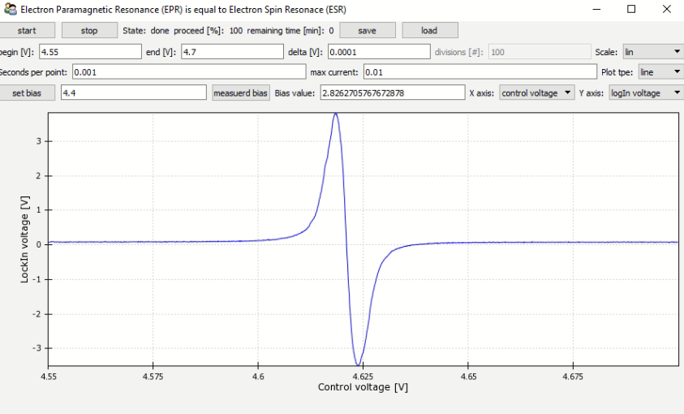

# EPR: Electron Paramagnetic Resonance

The EPR *project* provides the measurement software for the EPR lab course as conducted at the University of Stuttgart, Germany.

## ToDo

- fix sweep from zero
- remove ghosting from other analog in channels [see this threat](https://knowledge.ni.com/KnowledgeArticleDetails?id=kA03q000000YHy6CAG&l=de-DE)

## Pre-Requisites

NI measurement Card

## Install

0. Install Microsoft Visual Studio Build Tools with VC C++ 14.0 or greater (https://visualstudio.microsoft.com/de/visual-cpp-build-tools/)
1. get [Miniconda3](https://docs.conda.io/en/latest/miniconda.html)
2. [Windows Only] start Anaconda Powershell 
3. within Anaconda Powershell navigate cloned git folder EPR
4. conda env create -f conda_epr.yml
5. *optional* pip install pillow, nidaqmx, fonttools, enable, chaco, wxPython

## Run

1. open conda shell
2. source activate epr *or* conda activate epr *or* activate epr
3. ipython
4. run epr.py

## Troubleshooting

Make sure Python 3.7.9 is installed
The most critical package is: enable. Make sure MVC is installed - step 0 above.

